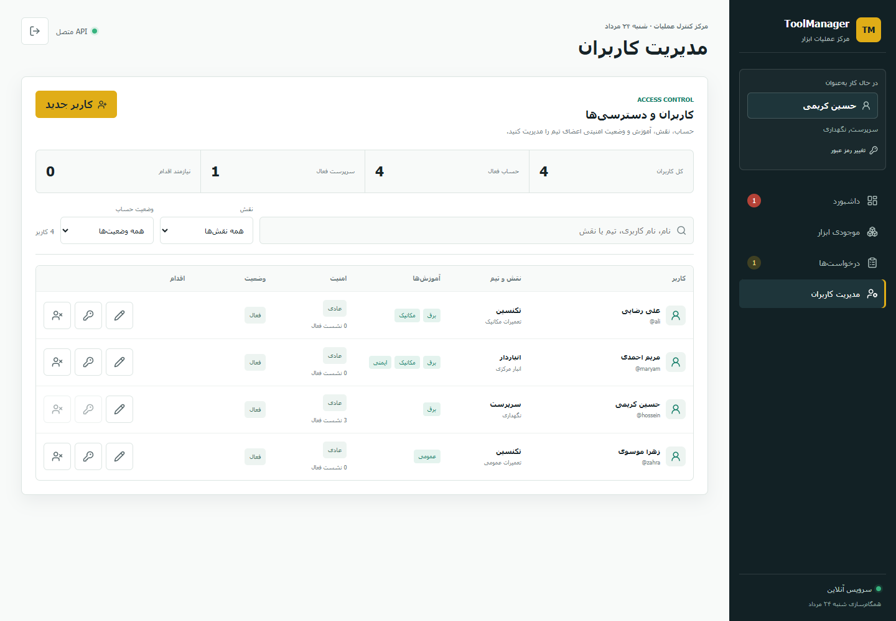
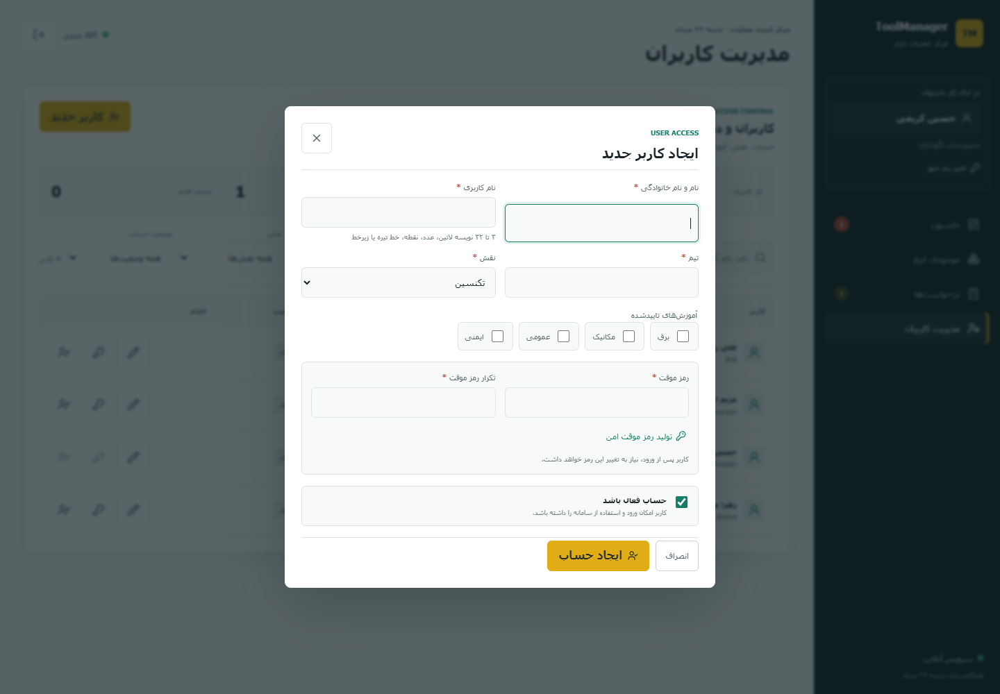
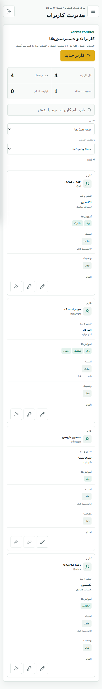

# ToolManager

سامانه وب RTL برای مدیریت چرخه عمر ابزارهای مشترک تیم تعمیرات: درخواست، صف، تایید، تحویل، بازگشت، بازرسی، خرابی و سرویس.

## قابلیت‌ها

- نقش‌های تکنسین، انباردار و سرپرست با مجوز سمت سرور
- احراز هویت نشست‌محور، تغییر رمز و خروج امن
- پنل سرپرست برای ایجاد، ویرایش، فعال/غیرفعال‌سازی، بازنشانی رمز و بازکردن قفل کاربران
- صف عادلانه با اولویت اضطراری، رزرو موجودی و جلوگیری از race condition
- کنترل آموزش اجباری برای ابزارهای حساس
- ثبت تحویل/بازگشت، وضعیت آسیب‌دیده و صف سرویس
- تاریخچه audit، health/readiness، هدرهای امنیتی و ارائه build Vue از Express
- SQLite داخلی Node.js 24؛ بدون dependency پایگاه‌داده جداگانه

## اجرای توسعه

```bash
npm install
npm run install:all
npm run dev
```

فرانت‌اند در `http://localhost:5173` و API توسعه در `http://localhost:3000` در دسترس است. در محیط توسعه رمز اولیه همه کاربران `ToolManager123!` است؛ فقط برای توسعه است و بعد از ورود باید تعویض شود. حساب seed سرپرست `hossein` است.

## اجرای production

برای اجرای مستقیم:

```bash
copy .env.example .env
npm run build
npm start
```

برای استقرار پیشنهادی:

```bash
copy .env.example .env
# APP_ORIGIN، TOOLMANAGER_INITIAL_PASSWORD و تنظیم TLS را اصلاح کنید
docker compose up -d --build
docker compose ps
```

پورت برنامه عمداً روی loopback منتشر می‌شود و باید پشت reverse proxy دارای HTTPS قرار گیرد. راهنمای کامل در [docs/DEPLOYMENT.md](docs/DEPLOYMENT.md) است.

## نماهای پنل مدیریت کاربران

### دسکتاپ



### ایجاد کاربر



### موبایل



## داده و مهاجرت

منبع حقیقت production فایل `server/data/toolmanager.sqlite` (یا مقدار `TOOLMANAGER_DATABASE_PATH`) است. در نخستین راه‌اندازی، اگر `server/data.json` نسخه MVP موجود باشد، به‌صورت خودکار به SQLite وارد می‌شود. فایل SQLite، `.env` و داده عملیاتی در Git قرار نمی‌گیرند.

## مستندات

- [استقرار](docs/DEPLOYMENT.md)
- [راهنمای کاربری](docs/USER_GUIDE.md)
- [عملیات و نگهداری](docs/OPERATIONS.md)
- [توسعه](docs/DEVELOPMENT.md)
- [API](docs/API.md)
- [امنیت](SECURITY.md)
- [مشارکت](CONTRIBUTING.md)

## بررسی کیفیت

```bash
npm test
npm run build
npm run check
```

برای production واقعی، TLS، backup زمان‌بندی‌شده، پایش `/api/health` و `/api/ready` و مدیریت secret در خارج از repository الزامی است.
